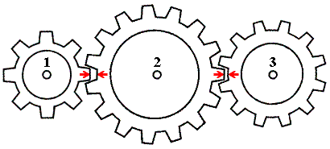

Условия:
- 1 шестеренка - 8 зубьев
- 2 шестеренка - 15 зубьев
- 3 шестеренка - 12 зубьев

В какую сторону и с какой скоростью будет вращаться 3 шестеренка если 1 шестеренка вращается по часовой стрелке со скоростью 9000 об/мин?
